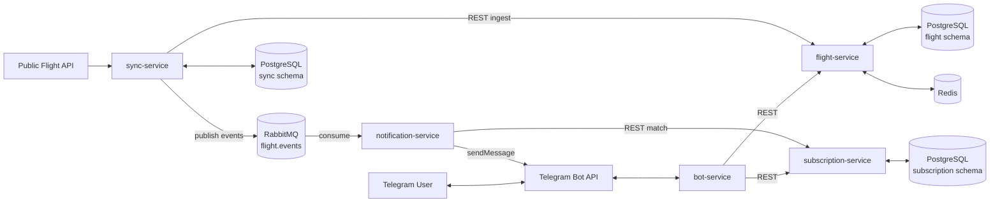

# Architecture

## 1. System context

Users never talk to anything but Telegram. Telegram delivers updates to
`bot-service` via webhook; `bot-service` is a thin, stateless orchestrator
that calls `flight-service` and `subscription-service` over REST and replies
to the chat. Outbound, unsolicited notifications are produced by
`sync-service` detecting a status change and are delivered by
`notification-service`, which is the only service besides `bot-service` that
talks to the Telegram Bot API (outbound `sendMessage`, no webhook).

## 2. Services

### 2.1 bot-service

- Owns the Telegram webhook endpoint and the command grammar (see
  [docs/api-contracts/bot-service.md](api-contracts/bot-service.md)).
- Stateless: holds no business data, only a short-lived request context.
- Calls `flight-service` (search) and `subscription-service` (CRUD) over
  REST, formats results as Telegram messages.
- Owns no database.

### 2.2 subscription-service

- System of record for Telegram chats and their subscriptions.
- Two subscription kinds: `flight` (exact flight number) and `route`
  (origin/destination IATA pair).
- Exposes CRUD REST API consumed by `bot-service` (user-driven changes) and
  a read-only **match** endpoint consumed by `notification-service`
  (`GET /internal/v1/subscriptions/match`).
- Owns PostgreSQL schema `subscription`. No other service may query it
  directly.

### 2.3 flight-service

- System of record for the *current, canonical* status of a flight
  (the "read model" the bot searches against).
- Exposes public search endpoints (by flight number, by route) backed by
  Redis (cache-aside, TTL ~60s for hot lookups) in front of PostgreSQL.
- Exposes an **internal ingest** endpoint used exclusively by
  `sync-service` to write normalized flight data
  (`POST /internal/v1/flights/ingest`). This is the only write path into the
  `flight` schema — nothing else touches it directly, including `sync-service`.
- On ingest, `flight-service` diffs the incoming snapshot against the row it
  already owns, persists the change, and returns the previous/new status to
  the caller so `sync-service` can decide whether to publish a domain event.
  (Change *detection* content lives in `sync-service`'s own snapshot store,
  see below — this in-transaction diff in `flight-service` is a second,
  authoritative confirmation to avoid duplicate/racing events if two sync
  runs overlap.)
- Owns PostgreSQL schema `flight` + Redis cache namespace `flight:*`.

### 2.4 sync-service

- Polls the configured public flight API on a fixed interval (5 minutes,
  driven by a Kubernetes `CronJob`, not an in-process ticker — see
  [helm-structure.md](deployment/helm-structure.md)).
- Normalizes provider-specific payloads into the canonical `FlightSnapshot`
  shape (see [database/sync-service.sql](database/sync-service.sql) and the
  event schema).
- Maintains **its own** lightweight PostgreSQL schema (`sync`) that stores
  only the last raw snapshot/hash per flight, used purely to cheaply decide
  "did anything change since the last poll" without calling out to
  `flight-service` for every unchanged flight.
- For flights whose snapshot changed, calls `flight-service`'s internal
  ingest endpoint (REST — never a direct DB write) to persist the new
  canonical status, then publishes the corresponding domain event(s) to the
  `flight.events` RabbitMQ exchange.
- This design keeps "each service owns its schema" intact: `sync-service`'s
  schema is a private ingestion cache, not a copy of `flight-service`'s data
  that other services could accidentally depend on.
- Owns PostgreSQL schema `sync`. No Redis. No inbound REST API except
  `/health`, `/ready`, `/metrics`, and an operator-only
  `POST /internal/v1/sync/trigger` for manual/ad-hoc runs.

### 2.5 notification-service

- Consumes `flight.events` from RabbitMQ (topic exchange, routing keys
  `flight.*`).
- For each event, calls `subscription-service`'s match endpoint to resolve
  the list of Telegram chat IDs subscribed to that flight number *or* to its
  route.
- Formats and sends Telegram messages directly via the Bot API
  (`sendMessage`); does not go through `bot-service`.
- Idempotent consumption: dedupes on `event_id` (short-lived Redis-less
  dedupe via a small in-schema `processed_events` table, since this service
  intentionally has no Redis dependency) to survive at-least-once delivery
  and consumer restarts.
- Owns PostgreSQL schema `notification` (just `processed_events` +
  delivery log — see database doc). No Redis.

## 3. Communication matrix

| Caller | Callee | Protocol | Purpose |
|---|---|---|---|
| Telegram | bot-service | HTTPS webhook | inbound updates |
| bot-service | flight-service | REST/JSON | search by flight number / route |
| bot-service | subscription-service | REST/JSON | create/list/delete subscriptions, upsert chat |
| sync-service | flight-service | REST/JSON (internal) | ingest normalized snapshot |
| sync-service | RabbitMQ (`flight.events`) | AMQP publish | domain events |
| notification-service | RabbitMQ (`flight.events`) | AMQP consume | domain events |
| notification-service | subscription-service | REST/JSON (internal) | resolve subscribers for a flight/route |
| notification-service | Telegram Bot API | HTTPS | outbound `sendMessage` |

Internal-only endpoints (never exposed outside the cluster) are namespaced
under `/internal/v1/...` and protected by a shared-secret / mTLS
`NetworkPolicy` boundary (see Helm structure doc) rather than being reachable
from the public Ingress.

## 4. Design principles applied

- **Clean Architecture / DDD-lite per service**: `handler` (transport) →
  `service` (use cases) → `repository` (persistence port) → `model`
  (domain entities), with `internal/api` holding DTOs/wire types kept
  separate from domain models.
- **Repository pattern**: GORM lives only behind repository interfaces;
  services depend on interfaces, not GORM types, so persistence is
  swappable/testable.
- **Dependency Injection**: constructed explicitly in `cmd/main.go` (no DI
  framework) — config → logger → repositories → services → handlers → HTTP
  server, wired by hand for clarity and compile-time safety.
- **Event-driven architecture**: state-change facts (`FlightDelayed`, ...)
  are the integration contract between `sync-service` and
  `notification-service` — they never share a database.
- **SOLID**: small interfaces per repository/service (e.g.
  `FlightRepository`, `FlightSearchService`, `NotificationSender`), handlers
  depend on service interfaces, not concrete types.
- **Graceful shutdown**: every service traps `SIGTERM`, stops accepting new
  HTTP/AMQP work, drains in-flight requests with a bounded timeout, closes
  DB/Redis/AMQP connections, matching Kubernetes' `terminationGracePeriodSeconds`.
- **Context propagation**: `context.Context` carries request-scoped
  deadlines, cancellation, and a correlation ID from the first hop
  (Telegram webhook or CronJob run) through every downstream REST/AMQP call
  and into structured logs.
- **Structured logging**: Zap, JSON in non-local environments, one logger
  per request/event carrying `correlation_id`, `service`, `chat_id`/`flight_number`
  where applicable.
- **Config via ENV**: Viper reads `.env`/ConfigMap-mounted files with ENV
  override; no secrets in ConfigMaps (see Helm structure doc — secrets are
  separate Kubernetes `Secret` objects).

## 5. Future extensibility

New capabilities are added as **new services** that plug into the existing
event bus and REST contracts without modifying existing services:

| Future service | Integration point |
|---|---|
| Airport Service | new REST API; `bot-service` adds a new command that calls it |
| Weather Service | subscribes to `flight.events` (e.g. enrich delay reasons) or polled independently |
| Price Tracker | own poller (same pattern as `sync-service`) + own events (`fare.events`) |
| Flight Prediction | consumes `flight.events` as training/inference input, publishes `flight.prediction.events` |
| Email Notification | new consumer of `flight.events`, alternate `NotificationSender` implementation, own subscription channel type in `subscription-service` (`type = email`) |
| Web Dashboard | new read-only REST client of `flight-service` / `subscription-service`; no changes to either |

This works because: (1) all cross-service integration is REST or
AMQP — never shared databases; (2) `flight.events` is versioned and
additive; (3) `subscription-service`'s `type` enum and delivery-channel
concept are designed to extend (e.g. `email`) without breaking existing
`flight`/`route` subscriptions.
