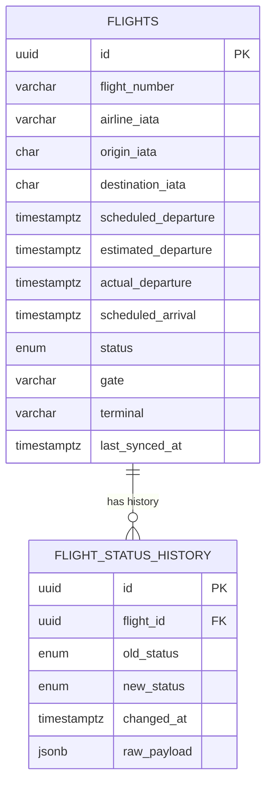
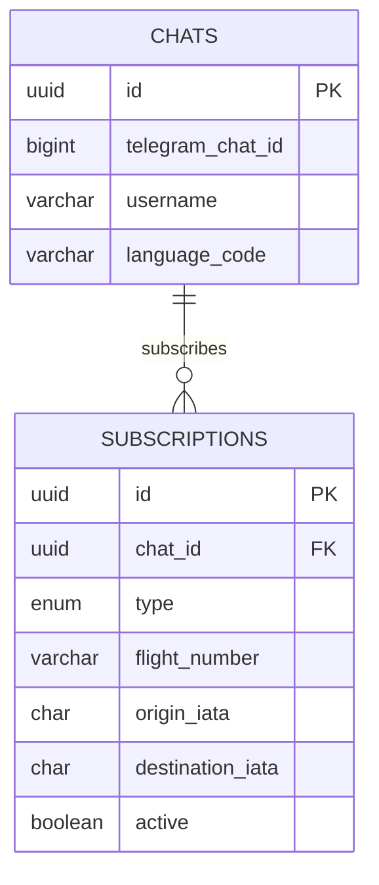
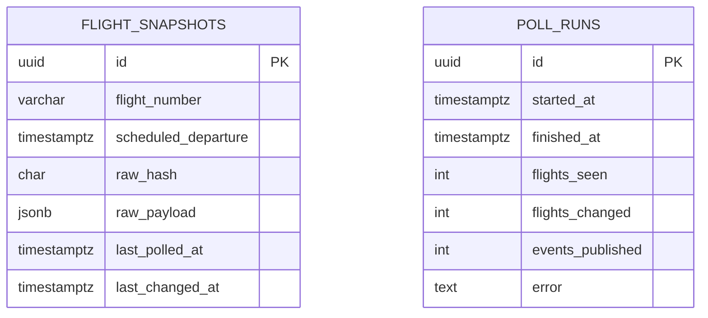
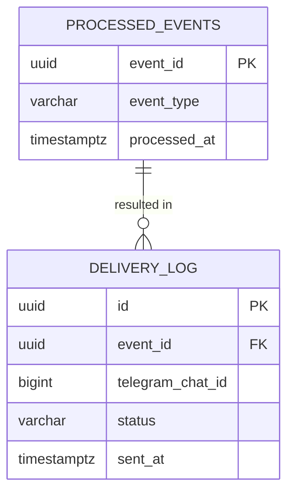

# Entity Relationship Diagrams

Each schema below lives in a **separate logical database/schema per service**
(one PostgreSQL cluster can host all schemas for a small deployment, or each
service can point at its own instance — the application layer never assumes
either). No foreign keys cross schema boundaries; cross-service references
(e.g. `flight_number` appearing in both `subscription` and `flight`) are
plain values, resolved via REST, never joined in SQL.

## flight schema

## subscription schema

## sync schema

## notification schema

