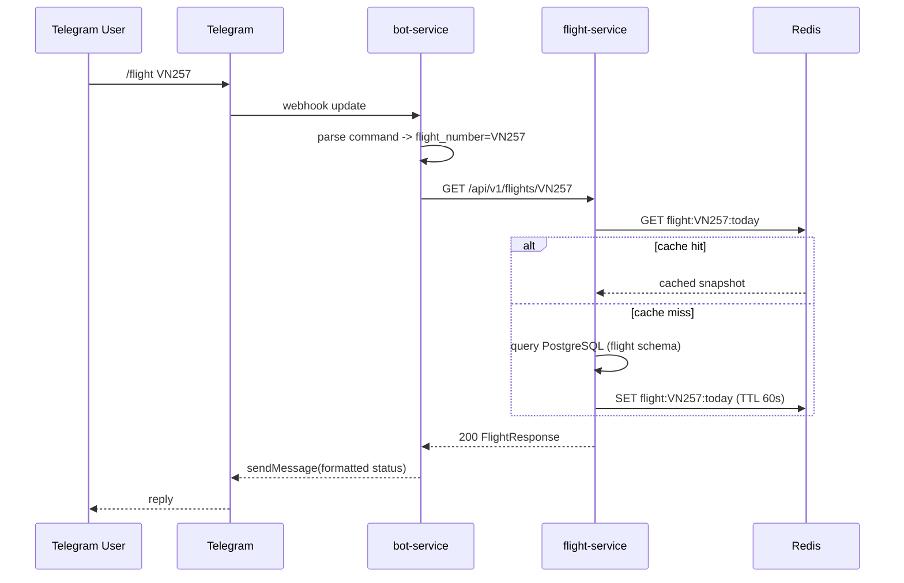
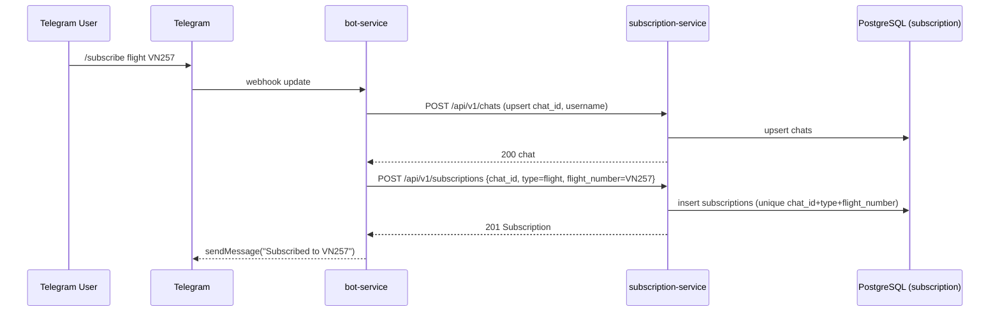
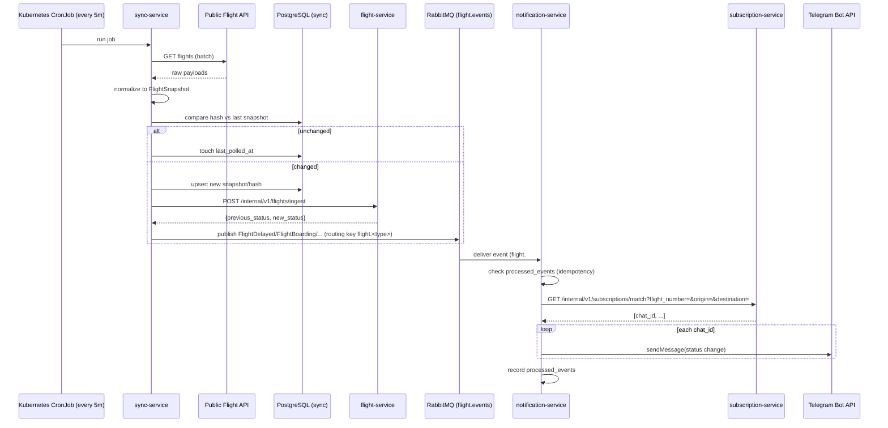
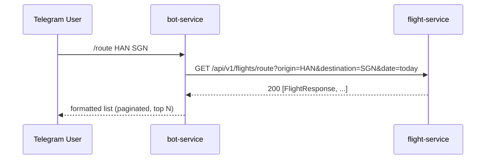

# Sequence Diagrams

## 1. `/flight VN257` search

```mermaid
sequenceDiagram
    participant U as Telegram User
    participant TG as Telegram
    participant BOT as bot-service
    participant FS as flight-service
    participant R as Redis

    U->>TG: /flight VN257
    TG->>BOT: webhook update
    BOT->>BOT: parse command -> flight_number=VN257
    BOT->>FS: GET /api/v1/flights/VN257
    FS->>R: GET flight:VN257:today
    alt cache hit
        R-->>FS: cached snapshot
    else cache miss
        FS->>FS: query PostgreSQL (flight schema)
        FS->>R: SET flight:VN257:today (TTL 60s)
    end
    FS-->>BOT: 200 FlightResponse
    BOT-->>TG: sendMessage(formatted status)
    TG-->>U: reply
```

## 2. `/subscribe flight VN257`

```mermaid
sequenceDiagram
    participant U as Telegram User
    participant TG as Telegram
    participant BOT as bot-service
    participant SUB as subscription-service
    participant PG as PostgreSQL (subscription)

    U->>TG: /subscribe flight VN257
    TG->>BOT: webhook update
    BOT->>SUB: POST /api/v1/chats (upsert chat_id, username)
    SUB->>PG: upsert chats
    SUB-->>BOT: 200 chat
    BOT->>SUB: POST /api/v1/subscriptions {chat_id, type=flight, flight_number=VN257}
    SUB->>PG: insert subscriptions (unique chat_id+type+flight_number)
    SUB-->>BOT: 201 Subscription
    BOT-->>TG: sendMessage("Subscribed to VN257")
```

## 3. sync-service poll → event → notification

```mermaid
sequenceDiagram
    participant CJ as Kubernetes CronJob (every 5m)
    participant SYNC as sync-service
    participant EXT as Public Flight API
    participant SPG as PostgreSQL (sync)
    participant FS as flight-service
    participant MQ as RabbitMQ (flight.events)
    participant NOTIF as notification-service
    participant SUB as subscription-service
    participant TG as Telegram Bot API

    CJ->>SYNC: run job
    SYNC->>EXT: GET flights (batch)
    EXT-->>SYNC: raw payloads
    SYNC->>SYNC: normalize to FlightSnapshot
    SYNC->>SPG: compare hash vs last snapshot
    alt unchanged
        SYNC->>SPG: touch last_polled_at
    else changed
        SYNC->>SPG: upsert new snapshot/hash
        SYNC->>FS: POST /internal/v1/flights/ingest
        FS-->>SYNC: {previous_status, new_status}
        SYNC->>MQ: publish FlightDelayed/FlightBoarding/... (routing key flight.<type>)
    end

    MQ->>NOTIF: deliver event (flight.#)
    NOTIF->>NOTIF: check processed_events (idempotency)
    NOTIF->>SUB: GET /internal/v1/subscriptions/match?flight_number=&origin=&destination=
    SUB-->>NOTIF: [chat_id, ...]
    loop each chat_id
        NOTIF->>TG: sendMessage(status change)
    end
    NOTIF->>NOTIF: record processed_events
```

## 4. `/route HAN SGN`

```mermaid
sequenceDiagram
    participant U as Telegram User
    participant BOT as bot-service
    participant FS as flight-service

    U->>BOT: /route HAN SGN
    BOT->>FS: GET /api/v1/flights/route?origin=HAN&destination=SGN&date=today
    FS-->>BOT: 200 [FlightResponse, ...]
    BOT-->>U: formatted list (paginated, top N)
```
