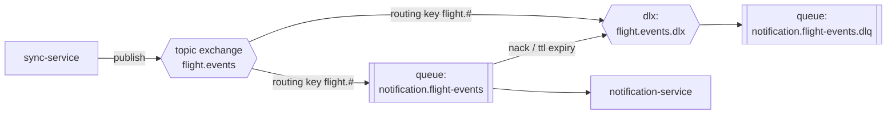

# Event Catalog (RabbitMQ)

## Topology



| Item | Value |
|---|---|
| Exchange | `flight.events` (type `topic`, durable) |
| Dead-letter exchange | `flight.events.dlx` (type `fanout`, durable) |
| Consumer queue | `notification.flight-events` (durable, bound to `flight.events` with routing key `flight.#`, `x-dead-letter-exchange=flight.events.dlx`) |
| Dead-letter queue | `notification.flight-events.dlq` (bound to `flight.events.dlx`) |
| Retry policy | Consumer nacks with requeue=false on transient failure after 3 in-process retries with backoff; message lands in DLQ for manual/automated replay. `x-message-ttl` on the primary queue is *not* set — only explicit nack routes to DLQ, so a slow-but-alive consumer never loses messages to TTL. |
| Delivery guarantee | At-least-once. Consumers must be idempotent (see `processed_events` table in [database/notification-service.sql](../database/notification-service.sql)). |
| Publisher confirms | Enabled (`publisher confirms` / `mandatory` flag) on `sync-service`'s channel; failed publishes are logged and retried by the next poll cycle at worst. |

## Routing keys

| Routing key | Event type |
|---|---|
| `flight.created` | `FlightCreated` |
| `flight.updated` | `FlightUpdated` |
| `flight.delayed` | `FlightDelayed` |
| `flight.boarding` | `FlightBoarding` |
| `flight.departed` | `FlightDeparted` |
| `flight.landed` | `FlightLanded` |
| `flight.cancelled` | `FlightCancelled` |

`FlightCreated` fires the first time sync-service observes a flight
(no previous snapshot). `FlightUpdated` fires for changes that aren't one of
the more specific status transitions (e.g. gate change while still
`SCHEDULED`). The status-specific events fire when `new_status` transitions
into that value; `flight-service`'s ingest response (`previous_status` /
`new_status`) is what sync-service uses to pick the routing key — see
sequence diagram 3 in [diagrams/sequence-diagrams.md](../diagrams/sequence-diagrams.md).

## Envelope

All events share one envelope, defined in
[schemas/flight-event.schema.json](schemas/flight-event.schema.json):

```json
{
  "event_id": "b3a1e6d2-9c1a-4e0a-9f3a-2f6a7c9d1e11",
  "event_type": "FlightDelayed",
  "version": "1.0",
  "occurred_at": "2026-07-09T07:12:00Z",
  "correlation_id": "sync-run-20260709-0710",
  "flight": {
    "flight_number": "VN257",
    "airline_iata": "VN",
    "origin_iata": "HAN",
    "destination_iata": "SGN",
    "scheduled_departure": "2026-07-09T07:30:00Z",
    "estimated_departure": "2026-07-09T08:10:00Z",
    "actual_departure": null,
    "scheduled_arrival": "2026-07-09T09:20:00Z",
    "estimated_arrival": "2026-07-09T10:00:00Z",
    "actual_arrival": null,
    "gate": "12",
    "terminal": "T1",
    "status": "DELAYED",
    "previous_status": "SCHEDULED"
  },
  "metadata": {
    "source": "sync-service",
    "provider": "example-flight-api"
  }
}
```

## Additive versioning rule

`version` is a string `MAJOR.MINOR`. New optional fields bump `MINOR` and
must be ignored by unknown consumers. Breaking changes (removing/renaming a
field, changing a type) bump `MAJOR` and are published to a **new** routing
key namespace (`flight.v2.*`) so `v1` consumers keep working during
migration — this is how future services (Price Tracker, Flight Prediction)
can consume the same exchange without coordinating deploys with
`sync-service`.
